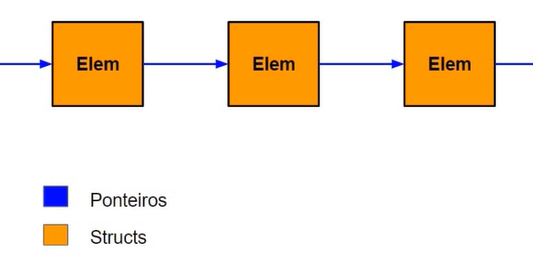

# Oque são Listas?

Listas são conunto de diversos elementos organizados em uma determinada sequência, sendo passível de inserções e remoções 

### Listas Encadeadas

Na computação, uma lista é implementada como lista encadeada.
Um elemento é encadeado um à outro de forma que cada elemento tem:
- No maximo 1 elemento subsequente
- No maximo 1 elemento antecedente

Em uma lista encadeada, podem ocorrer inserções e remoções em quaisquer posiçoes de uma lista

### Listas Encadeadas

Uma lista é implementada com a utilização de:

- Structs: representam cada um dos elementos da lista
- Ponteiros: realizam o encadeamento entre um elemento e outro
- Alocação Dinâmica: responsavel por reservar espaço em tempo de execução para novos elementos da lista encadeada
  
    

### Pontos Positivos

 - Alocação sob-demanda
 - Inserção e remoção no meio da estrutura não necessita da realocação dos demais elementos

### Pontos Negativos

- Estruturas não estão linearmente na memória
  - Buscar por elemento se torna mais onerosa
- Inserção e remoção pode se tornar trabalhosa se a posição requerida está muito distante
  - Necessidade de percorrer toda a lista para inserir ou remover
  